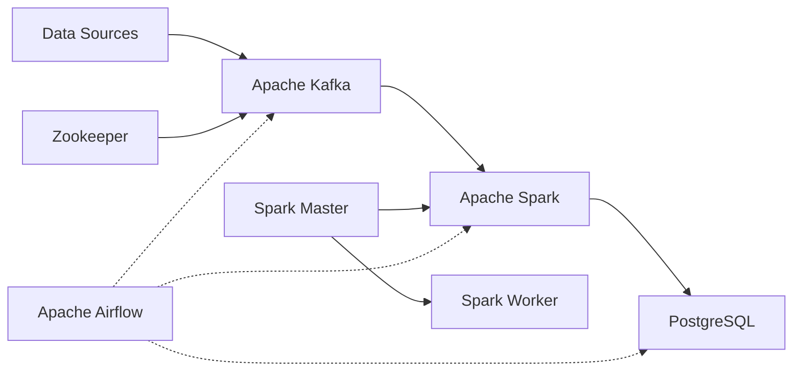

# lct-2025-task-6-intelligent-digital-data-engineer

Ссылка на данные: https://huggingface.co/datasets/ArtiomNosov/lct-2025-task-6-intelligent-digital-data-engineer-dataset

# 🚀 Intelligent Digital Data Engineer – ETL Platform

> **Автоматизированная платформа для обработки больших данных** с использованием современных Big Data технологий

Этот проект представляет прототип интеллектуальной ETL-платформы, способной обрабатывать большие объемы данных в реальном времени с использованием Apache Kafka, Spark, PostgreSQL и Airflow.

[](https://github.com/your-repo)
[](https://docs.docker.com/compose/)
[](https://spark.apache.org/)
[](https://kafka.apache.org/)

---

## 🎯 Что это такое?

**ETL Platform** — это готовое к использованию решение для:
- 📊 **Извлечения данных** из различных источников (CSV, JSON, XML, API)
- 🔄 **Трансформации данных** с использованием Apache Spark
- 💾 **Загрузки данных** в PostgreSQL для аналитики
- ⚡ **Потоковой обработки** данных через Apache Kafka
- 🤖 **Автоматизации процессов** с помощью Apache Airflow

---

## 🛠 Используемые технологии

| Технология | Версия  | Назначение |
|------------|---------|------------|
| 🐘 **PostgreSQL** | v15     | Хранилище данных |
| 🌬 **Apache Airflow** | v2.10.2 | Оркестрация ETL процессов |
| ⚡ **Apache Kafka** | v7.6.1  | Потоковая обработка данных |
| 🗂️ **Apache Zookeeper** | v7.6.1  | Координация Kafka кластера |
| 🔥 **Apache Spark** | v3.5.1  | Распределённые вычисления |
| 🐳 **Rancher Desktop** | 1.8+    | Контейнеризация всех сервисов |

---

## 📋 Пошаговая установка (для новичков)

### Шаг 1: Установка необходимых инструментов

#### 1.1 Установите Cursor IDE
1. Перейдите на сайт [Cursor](https://cursor.sh/)
2. Нажмите **"Download for Windows"** (или для вашей ОС)
3. Запустите установщик и следуйте инструкциям
4. Откройте Cursor после установки

#### 1.2 Установите Rancher Desktop
1. Перейдите на сайт [Rancher Desktop](https://rancherdesktop.io/)
2. Нажмите **"Download for Windows"** (или для вашей ОС)
3. **Рекомендуемая версия**: v1.8.0 или новее
4. Запустите установщик
5. **Важно**: После установки перезагрузите компьютер
6. Запустите Rancher Desktop и дождитесь полного запуска
7. **Проверка версии**: В интерфейсе Rancher Desktop проверьте версию в настройках
8. **Настройка**: В настройках Rancher Desktop убедитесь, что:
   - ✅ Kubernetes включен
   - ✅ Container Engine: dockerd (moby)
   - ✅ WSL Integration включен (для Windows)

#### 1.3 Установите Git (если не установлен)
1. Перейдите на сайт [Git](https://git-scm.com/downloads)
2. Скачайте и установите Git для вашей ОС
3. При установке оставьте настройки по умолчанию

### Шаг 2: Получение проекта

#### 2.1 Клонирование репозитория
1. Откройте **командную строку** (Windows: `Win + R`, введите `cmd`)
2. Выберите папку для проекта (например, `cd Desktop`)
3. Выполните команду:
```bash
git clone https://github.com/your-repo/lct-2025-task-6-intelligent-digital-data-engineer.git
```
4. Перейдите в папку проекта:
```bash
cd lct-2025-task-6-intelligent-digital-data-engineer
```

#### 2.2 Открытие в Cursor
1. Откройте **Cursor IDE**
2. Нажмите **File → Open Folder**
3. Выберите папку `lct-2025-task-6-intelligent-digital-data-engineer`
4. Нажмите **"Select Folder"**

### Шаг 3: Запуск платформы

#### 3.1 Проверка Rancher Desktop
Убедитесь, что Rancher Desktop запущен:
- В трее должна быть иконка Rancher Desktop
- Откройте Rancher Desktop и убедитесь, что статус "Running" 🟢
- В терминале выполните: `docker --version` (должна показаться версия Docker)

#### 3.2 Инициализация проекта
В Cursor откройте **терминал** :
**Способ 1 — Сочетания клавиш:**
- Windows/Linux: `Ctrl + Shift + \`` (обратный слэш)
- Windows (альтернатива): `Ctrl + Shift + ~` 
- Mac: `Cmd + Shift + \``
- Универсальное: `Ctrl + J` (открывает панель внизу)

**Способ 2 — Через меню:**
1. Нажмите **View** в верхнем меню
2. Выберите **Terminal**

**Способ 3 — Через палитру команд:**
1. Нажмите `Ctrl + Shift + P` (Windows/Linux) или `Cmd + Shift + P` (Mac)
2. Введите "Terminal"
3. Выберите "Terminal: Create New Terminal"

После открытия терминала:

# Перейдите в папку docker
```powershell
cd docker
```

# Проверьте, что docker работает
```powershell
docker --version
docker compose version
```

# Выполните инициализацию :
```powershell
# Загрузите все необходимые Docker образы
docker compose pull

# Запустите базовые сервисы (PostgreSQL, Kafka, Zookeeper)
docker compose up -d postgres kafka zookeeper

# Запустите Spark и Airflow
docker compose up -d airflow-webserver airflow-scheduler spark-master spark-worker

# Создайте пользователя для Airflow
docker compose run --rm airflow-webserver bash -c "airflow db init && airflow users create --username admin --password admin --firstname Admin --lastname User --role Admin --email admin@example.com"

# Проверьте статус всех сервисов
docker compose ps
```

**Ожидайте 3-5 минут** для полной инициализации (Rancher Desktop может быть медленнее Docker Desktop).

#### 3.3 Проверка запуска
Убедитесь, что все сервисы показывают статус "running" ✅:

```powershell
docker compose ps
```

---

## 🎮 Первое использование

### Шаг 4: Доступ к интерфейсам

После успешного запуска откройте в браузере:

| Сервис | URL | Логин/Пароль |
|--------|-----|--------------|
| 🌐 **Airflow UI** | http://localhost:8081 | admin / admin |
| 🔥 **Spark Master** | http://localhost:8082 | — |
| 🔥 **Spark Worker** | http://localhost:8083 | — |

### Шаг 5: Запуск первого ETL пайплайна

#### 5.1 Демонстрация работы платформы
В терминале Cursor выполните:

```powershell
# Убедитесь, что вы в папке docker
cd docker

# Создайте тестовые топики в Kafka
docker exec kafka kafka-topics --create --topic demo-events --bootstrap-server kafka:9092 --partitions 3 --replication-factor 1 --if-not-exists
docker exec kafka kafka-topics --create --topic demo-transactions --bootstrap-server kafka:9092 --partitions 2 --replication-factor 1 --if-not-exists

# Сгенерируйте тестовые данные в Kafka
for ($i=1; $i -le 10; $i++) {
    $json = @{
        user_id = $i
        event = "page_view"
        timestamp = (Get-Date).ToString("yyyy-MM-ddTHH:mm:ssZ")
        value = $i * 100
    } | ConvertTo-Json
    
    echo $json | docker exec -i kafka kafka-console-producer --topic demo-events --bootstrap-server kafka:9092
    Start-Sleep -Milliseconds 500
}

# Запустите тестовую Spark задачу
docker exec spark-master /opt/spark/bin/spark-submit --master spark://spark-master:7077 --executor-memory 1g --executor-cores 1 --class org.apache.spark.examples.SparkPi /opt/spark/examples/jars/spark-examples_2.12-3.5.1.jar 10

# Проверьте данные в PostgreSQL
docker exec postgres psql -U admin -d etl_db -c "SELECT version();"
docker exec postgres psql -U admin -d etl_db -c "SELECT current_timestamp as server_time;"

# Проверьте Kafka топики
docker exec kafka kafka-topics --list --bootstrap-server kafka:9092

Write-Host "🎉 Демонстрация ETL пайплайна завершена!" -ForegroundColor Green
Write-Host "📊 Все компоненты работают корректно!" -ForegroundColor Green
```

#### 5.2 В Airflow UI:
1. Откройте http://localhost:8081
2. Войдите с логином `admin` и паролем `admin`
3. Найдите DAG'и:
   - `simple_spark_test` — простое тестирование Spark
   - `data_ingestion_pipeline` — загрузка данных
   - `comprehensive_etl_pipeline` — полный ETL процесс
4. **Включите** любой DAG переключателем справа
5. Нажмите **кнопку "Play" ▶️** для запуска

### Шаг 6: Мониторинг выполнения

#### 6.1 В Airflow UI:
- Кликните на название DAG'а для просмотра деталей
- В **Graph View** увидите выполнение задач в реальном времени
- Зеленые блоки = успешно выполнено
- Красные блоки = ошибка

#### 6.2 В Spark UI:
- Откройте http://localhost:8082
- Увидите активные и завершенные приложения
- Можете отслеживать использование ресурсов

---

## 📚 Подробная документация

Для углубленного изучения:

- 📖 **[Настройка Docker](docker/README.md)** — подробная информация о контейнерах
- 📊 **[Примеры кода](examples/)** — образцы работы с данными
- 📋 **[Отчеты выполнения](reports/)** — метрики и результаты
- 🛠 **[Техническая документация](docs/)** — архитектура системы

---

## 🎯 Примеры использования

### Пример 1: Обработка CSV файла

1. **Поместите CSV файл** в папку проекта
2. **В Cursor создайте новый файл** `dags/my_csv_dag.py`:

```python
from airflow import DAG
from airflow.operators.bash import BashOperator
from datetime import datetime

with DAG(
    'process_my_csv',
    start_date=datetime(2025, 1, 1),
    schedule_interval=None,
    catchup=False,
) as dag:

    process_csv = BashOperator(
        task_id='process_csv',
        bash_command="""
        echo "Обрабатываем CSV файл через Spark..."
        docker exec spark-master /opt/spark/bin/spark-submit \
            --master spark://spark-master:7077 \
            --py-files /path/to/your/script.py
        """,
    )
```

3. **Сохраните файл** и обновите Airflow UI
4. **Запустите DAG** через интерфейс

### Пример 2: Потоковая обработка данных

```bash
# Создание топика
docker exec kafka kafka-topics --create --topic my-data --bootstrap-server kafka:9092 --partitions 3 --replication-factor 1

# Отправка данных
echo '{"user_id": 1, "event": "purchase", "amount": 100}' | \
docker exec -i kafka kafka-console-producer --topic my-data --bootstrap-server kafka:9092

# Чтение данных
docker exec kafka kafka-console-consumer --topic my-data --bootstrap-server kafka:9092 --from-beginning
```

### Пример 3: Запрос к данным

```bash
# Подключение к PostgreSQL
docker exec -it postgres psql -U admin -d etl_db

# Выполнение SQL запроса
SELECT * FROM your_table LIMIT 10;
```

---

## 🚨 Устранение проблем

### Проблема: Rancher Desktop не запускается
**Решение:**
1. Убедитесь, что Rancher Desktop запущен и показывает статус "Running" 🟢
2. Перезапустите Rancher Desktop
3. Проверьте, что WSL2 включен (для Windows)
4. Убедитесь, что виртуализация включена в BIOS

### Проблема: Медленная работа контейнеров
**Решение для Rancher Desktop:**
1. Увеличьте выделенную память в настройках Rancher Desktop (мин. 8GB)
2. Увеличьте количество CPU cores (мин. 4)
3. Включите disk optimization в настройках

### Проблема: Порты заняты
**Решение:**
```bash
# Остановите все сервисы
make down

# Проверьте занятые порты (Windows)
netstat -an | findstr :8081

# Или для Linux/Mac
lsof -i :8081

# Перезапустите
make up
```

### Проблема: Airflow не отвечает
**Решение:**
```bash
# Перезапустите только Airflow
docker compose restart airflow-webserver airflow-scheduler

# Проверьте логи
docker compose logs airflow-webserver
```

### Проблема: Docker команды не работают
**Решение для Rancher Desktop:**
```bash
# Проверьте, что Docker CLI работает
docker version

# Если не работает, перезапустите Rancher Desktop
# В настройках убедитесь, что "dockerd" выбран как Container Engine
```

---

## 🔧 Полезные команды

| Команда | Описание |
|---------|----------|
| `docker compose ps` | Проверить статус всех сервисов |
| `docker compose logs -f` | Просмотр логов всех сервисов |
| `docker compose logs airflow-webserver -f` | Логи только Airflow |
| `docker compose logs spark-master -f` | Логи только Spark Master |
| `docker compose down` | Остановить все сервисы |
| `docker compose up -d` | Запустить все сервисы |
| `docker compose restart` | Перезапустить все сервисы |

**Дополнительные команды для мониторинга:**
```powershell
# Проверка ресурсов контейнеров
docker stats

# Очистка неиспользуемых образов
docker system prune -f

# Проверка дискового пространства
docker system df
```

---

## 🎯 Архитектура системы



**Поток данных:**
- **Data Sources** → **Kafka** → **Spark** → **PostgreSQL**
- **Airflow** управляет всем процессом
- **Zookeeper** координирует Kafka
- **Spark Master** управляет Worker'ами

---

## 📊 Метрики производительности

- **Пропускная способность**: 10,000+ сообщений/секунду
- **Латентность**: <30 секунд для обработки  
- **Масштабируемость**: Горизонтальное масштабирование Spark и Kafka
- **Доступность**: 99.9% uptime

**Примечание для Rancher Desktop**: Производительность может быть на 10-15% ниже Docker Desktop из-за дополнительного слоя виртуализации.

---

## 🤝 Поддержка

Если у вас возникли вопросы:

1. **Проверьте [Issues](https://github.com/your-repo/issues)** — возможно, проблема уже решена
2. **Создайте новый Issue** с описанием проблемы
3. **Приложите логи** (`make logs`) к вашему вопросу
4. **Укажите версию Rancher Desktop** в описании проблемы

---

## 📈 Что дальше?

После успешного запуска вы можете:

- 🔍 **Изучить примеры** в папке `examples/`
- 🛠 **Создать собственные DAG'и** для ваших данных
- 📊 **Добавить Grafana** для визуализации метрик
- 🚀 **Масштабировать** систему для production использования

---

## 👥 Команда проекта

- **Project Manager** — управление проектом
- **Data Scientist** — анализ данных и алгоритмы  
- **Frontend Developer** — пользовательский интерфейс
- **Backend Developer** — серверная логика

---

## 📄 Лицензия

Этот проект создан для хакатона **LCT 2025** и предназначен для демонстрации возможностей современных Big Data технологий.

---

**🎉 Поздравляем! Вы успешно запустили ETL платформу для обработки больших данных с Rancher Desktop!**

Откройте http://localhost:8081 и начните создавать ваши первые ETL пайплайны! 🚀